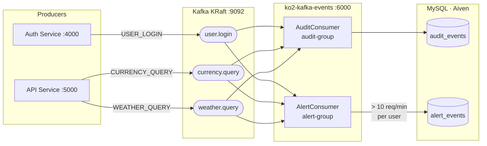

# ko2-kafka-events

Event-driven audit and rate-limit alerting microservice for the [KO2 Currency & Weather Hub](https://github.com/ko2javier/currency-data-hub) ecosystem — consumes Kafka events published by three upstream services and persists them to MySQL in real time.

---

## Why Kafka here

Audit logging is a cross-cutting concern that should never slow down the request path. Rather than adding synchronous REST calls to each service, producers fire-and-forget to a Kafka topic. This service consumes independently, at its own pace, with no coupling to upstream availability. If this service restarts, Kafka replays from the last committed offset — no audit events are lost.

---

## Architecture



Two independent consumer groups read all three topics in parallel:

- **`audit-group`** — persists every event to `audit_events` with manual ack; if an exception is thrown the offset is not committed and Kafka retries.
- **`alert-group`** — maintains an in-memory sliding window (60 s) per user using `ConcurrentHashMap<String, Deque<Instant>>`; writes to `alert_events` when a user exceeds 10 requests within the window.

---

## How it fits the ecosystem

This is the **third service** of a progressive microservices portfolio built on a single Hetzner VPS:

| # | Repo | Role |
|---|------|------|
| 1 | [api-gateway-currency-data-hub](https://github.com/ko2javier/api-gateway-currency-data-hub) | Spring Cloud Gateway — JWT validation, routing, Redis blacklist |
| 2 | [auth-currency-data-hub](https://github.com/ko2javier/auth-currency-data-hub) | Auth Service — login, JWT issuance, BCrypt, logout |
| 2 | [currency-data-hub](https://github.com/ko2javier/currency-data-hub) | API Service — weather + currency with multi-level cache |
| 3 | **ko2-kafka-events** | This service — event-driven audit + alerting |
| — | [ko2-platform-frontend](https://github.com/ko2javier/ko2-platform-frontend) | Angular 19 SPA — live dashboard |

The Gateway routes `/events/**` to this service. All endpoints require a JWT with `ROLE_ADMIN` — the same shared secret used across the ecosystem.

---

## Technical decisions

| Decision | Choice | Rationale |
|----------|--------|-----------|
| **Kafka ack mode** | `MANUAL_IMMEDIATE` | Offset committed only after successful DB write. If the write fails, Kafka retries on next poll — zero audit loss at the cost of possible duplicates (acceptable for audit). |
| **Two consumer groups** | `audit-group` + `alert-group` | Independent offset tracking: alert processing does not block or affect audit persistence, and each group can scale or fail independently. |
| **Alert state** | `ConcurrentHashMap<String, Deque<Instant>>` | Simple and sufficient for a single instance. Acknowledged limitation: horizontal scaling would require moving the window to Redis. This is documented as a known trade-off, not an oversight. |

---

## API endpoints

All endpoints require `Authorization: Bearer <token>` with `ROLE_ADMIN`.

### `GET /events/audit`

Returns a paginated list of audit events, ordered by timestamp descending.

Filters are **mutually exclusive** (applied in order):

| Parameter | Type | Description |
|-----------|------|-------------|
| `from` + `to` | `ISO-8601 datetime` | Date range filter. Both required together. |
| `username` | `string` | Filter by exact username. |
| `eventType` | `string` | `USER_LOGIN` · `CURRENCY_QUERY` · `WEATHER_QUERY` |
| `page` | `int` | Page number, 0-based. Default: `0`. |
| `size` | `int` | Page size, max 100. Default: `20`. |

**Response:** Spring `Page<AuditEntry>` — fields: `id`, `eventType`, `username`, `ipAddress`, `detail` (JSON metadata), `timestamp`.

---

### `GET /events/alerts`

Returns a paginated list of rate-limit alerts, ordered by detection time descending.

| Parameter | Type | Description |
|-----------|------|-------------|
| `username` | `string` | Filter alerts for a specific user. |
| `page` | `int` | Default: `0`. |
| `size` | `int` | Max 100. Default: `20`. |

**Response:** Spring `Page<AlertEntry>` — fields: `id`, `username`, `requestCount`, `windowStart`, `detectedAt`.

---

## Live demo

Swagger UI is available through the API Gateway at:

**[http://api.ko2-oreilly.com:7000/webjars/swagger-ui/index.html](http://api.ko2-oreilly.com:7000/webjars/swagger-ui/index.html)**

Select **"Kafka Events Service"** from the definition dropdown.

### Getting a token

```bash
curl -s -X POST http://api.ko2-oreilly.com:7000/auth/login \
  -H "Content-Type: application/json" \
  -d '{"username":"admin","password":"admin123"}' \
  | jq -r '.token'
```

Paste the token into the **Authorize** button (without the `Bearer` prefix). The `/events/audit` and `/events/alerts` endpoints will then be accessible via "Try it out".

---

## Stack

| Layer | Technology |
|-------|-----------|
| Language | Java 21 |
| Framework | Spring Boot 3.3.5 |
| Messaging | Apache Kafka (KRaft, no Zookeeper) |
| Persistence | Spring Data JPA · MySQL (Aiven) |
| Security | Spring Security · JJWT 0.12.3 (HS256) |
| Observability | Spring Actuator · Micrometer · Prometheus (port 6001) |
| API docs | springdoc-openapi 2.6.0 |
| Build | Gradle · Java 21 toolchain |
| Deploy | Docker · GitHub Actions → Hetzner VPS |

---

## Part of the KO2 ecosystem

| Repo | Description |
|------|-------------|
| [api-gateway-currency-data-hub](https://github.com/ko2javier/api-gateway-currency-data-hub) | Spring Cloud Gateway — JWT auth, Redis blacklist, Swagger aggregation |
| [auth-currency-data-hub](https://github.com/ko2javier/auth-currency-data-hub) | Auth microservice — login, JWT, BCrypt, logout |
| [currency-data-hub](https://github.com/ko2javier/currency-data-hub) | API microservice — weather + currency, multi-level cache (Redis → MySQL → external API) |
| [ko2-kafka-events](https://github.com/ko2javier/ko2-kafka-events) | **This repo** — event-driven audit and alerting |
| [ko2-platform-frontend](https://github.com/ko2javier/ko2-platform-frontend) | Angular 19 SPA — live dashboard with JWT login |
